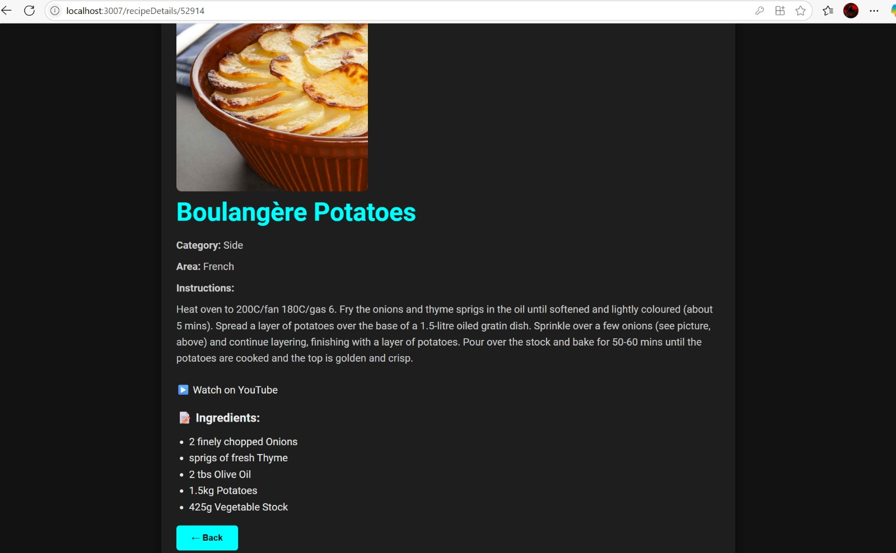

# Recipe Finder 🍽️


  
*This screenshot shows the **Random Recipe** feature in action: it fetches a completely random dish, displays its ingredients and instructions, and even embeds a short YouTube video tutorial for how to prepare it.*

## Project Description

Recipe Finder is a full-stack React application that lets users search, browse and save recipes from around the world. It includes email/password authentication (via Firebase), protected routes so only logged-in users can access certain pages, integration with TheMealDB for recipe data and an AI-powered “RecipeBot” assistant using OpenAI’s GPT-3.5.

---

## Features

- **User Authentication**  
  Register and login with email/password (Firebase Auth)  

- **Protected Routes**  
  Favorites and Recipe Details pages accessible only to authenticated users  

- **Recipe Search**  
  - Search by keyword  
  - Filter by cuisine (American, Italian, Indian, etc.)  
  - “Random Recipe” generator  

- **Favorites Management**  
  Add or remove recipes from your personal favorites list  

- **RecipeBot AI Assistant**  
  Ask cooking questions in natural language; answers powered by OpenAI GPT-3.5 Turbo  

- **Responsive UI**  
  Mobile-friendly design with reusable React components and CSS styling  

---

## Tech Stack & Required Libraries

- **Core**  
  - React (Create React App)  
  - React Router (`react-router-dom`)  
  - State management with React hooks (`useState`, `useEffect`)  

- **Authentication**  
  - Firebase SDK (`firebase`)  

- **API Communication**  
  - Axios (`axios`)  
  - TheMealDB public API  
  - OpenAI Chat Completions API  

- **UI & Icons**  
  - CSS modules / plain CSS  
  - React Icons (`react-icons`)  

- **Dev & Build**  
  - Node.js & npm  
  - `gh-pages` (if you choose GitHub Pages deployment)  

---

## Running the Project

Once you’ve cloned the repo and set up your `.env` (with your `REACT_APP_OPENAI_API_KEY` and Firebase config):

```bash
npm install
npm start
